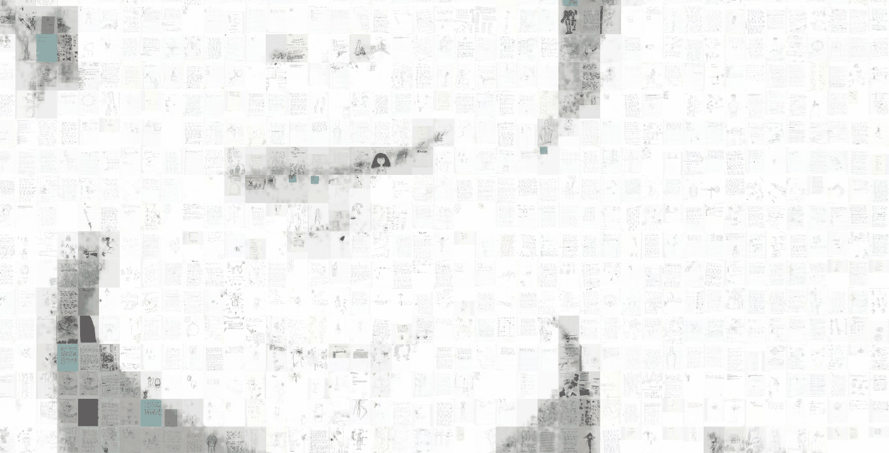

# Mosaic

A deep-zoom photomosaic: a portrait built from 2,226 scanned notebook pages and sketches, explored in the browser through a Leaflet tile viewer exported by AndreaMosaic.

   



The repo is private. To view the mosaic, serve the folder locally (see Quick start).

## Why

- See years of handwritten notes and sketches as a single image, then zoom in until each page is visible on its own.
- Pan and zoom smoothly over a 13,998 x 15,001 pixel image without loading it all at once.
- Host it anywhere: it is plain HTML, JavaScript and JPEG tiles, with no build step or backend.

## Features

- Portrait mosaic made of 2,226 tiles, each 265 x 358 pixels. Each tile is a different scanned page, used once.
- Deep zoom over seven zoom levels (0 to 6), served as 256 px JPEG tiles in a Zoomify-style pyramid.
- Mouse, touch and keyboard navigation from Leaflet: wheel or double-click to zoom, drag or the arrow keys to pan, plus and minus keys to zoom.
- Pan inertia for touch screens (`panInertia: true` in `index.html`).

## Quick start

Serve the folder with any static file server.

```bash
git clone https://github.com/mindattic/Mosaic.git
cd Mosaic
python -m http.server 8000
```

Open `http://localhost:8000/`. You should see the whole portrait centred on a white page. Double-click or scroll to zoom into the pages.

## How it works

```text
index.html
  tileArrays[]      position, size and image number of each of the 2,226 tiles
  mapOptions        popup, help, search and inertia settings
  ShowAndreaMosaic('AndreaMosaic', 'mosaic/', 13998, 15001, mapOptions)
        |
        v
app/leafletzoom.js  L.TileLayer.Zoomify over a Leaflet map (CRS.Simple)
        |
        v
mosaic/{group}/{zoom}-{x}-{y}.jpg   256 px tiles, 1,000 per group folder
```

`ShowAndreaMosaic` works out the zoom levels from the image size, fits the whole image in the window and loads only the tiles in view.

## Configuration

All settings live in the `mapOptions` object near the end of `index.html`.

| Option | Current value | Effect |
|---|---|---|
| `getPopUpText` | `getPopUpFullText` | Builds the per-tile info popup |
| `getHelpText` | `getHelpText` | Help table for the help button |
| `getSearchText` | `null` | Tile search is off |
| `zoomControl` | `false` | No plus and minus buttons |
| `fullscreenControl` | on except Apple browsers | Fullscreen button |
| `panInertia` | `true` | Momentum when panning |

The page also hides every Leaflet control with CSS (`.leaflet-control-container` is set to `display: none`), so the help and fullscreen buttons do not appear.

## Project layout

```text
Mosaic/
  index.html     viewer page, tile index and settings
  app/           Leaflet and plugins (zoom, fullscreen, easy-button, search)
  mosaic/0..4/   4,371 JPEG tiles in groups of 1,000 (about 81 MB)
  docs/images/   README images
```

## Limitations

- The per-tile info popup is effectively switched off: it listens for a `contextmenuX` event, which never fires.
- The tile index links each tile to the original scan files on the machine that built the mosaic. Those files are not in the repo.
- Changing the mosaic means re-exporting it from AndreaMosaic. Nothing in the repo rebuilds the tiles.

## Documentation

The repo has no separate docs. `index.html` contains the AndreaMosaic comments that explain the tile index and the popup functions.

## License

There is no LICENSE file for the mosaic, so all rights are reserved. The viewer files in `app/` are third-party code; licence files sit next to Control.FullScreen, easy-button, leaflet-search and the AndreaMosaic zoom script (`leafletzoom.js`). Leaflet 1.7.1 (`leaflet.js`) has only its copyright header and no separate licence file.

Part of [MindAttic](https://mindattic.com) — see more projects at [github.com/mindattic](https://github.com/mindattic).
